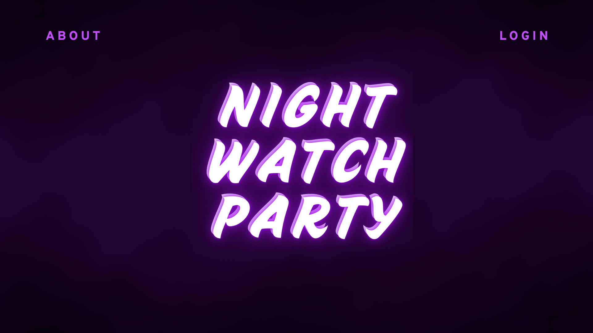

# Night Watch Party
Night Watch Party is an online movie group that began in October 2020 with a small band of film buffs. Over the years, the group's activity has fluctuated, but collective interest let to the group’s resurgence in the Spring of 2025.

The Night Watch Party website was created to provide organization and communication to the NWP community. While the site's main functions are closed to non-members, interested cinephiles can find tips for starting their own movie groups as well as peruse NWP's previous movie selections. 

🍿

## Table of Contents

*[Technologies](#technologies)
*[Mockup](#mockup)

## Technologies

This website is being built using the MERN stack and an unhealthy obsession with movies 🎬 

## Mockup

